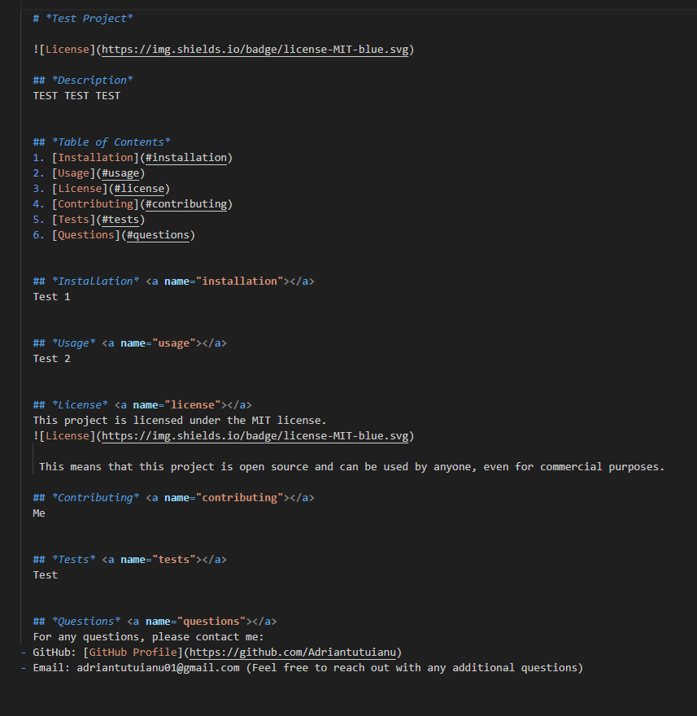

# Dynamic README Generator

## Description

The Dynamic README Generator is a command-line application designed to streamline the creation of a professional README.md file. Crafting a comprehensive README is essential for effective project communication, and this tool simplifies the process by utilizing the Inquirer package.

### Key Features

Effortless README Creation: Quickly generate a high-quality README by providing essential project information through a series of prompts.

Inquirer Package Integration: Utilize the popular Inquirer package to collect user input, ensuring a user-friendly and interactive experience.

Time-Saving: Allow project creators to focus more on actual project development rather than spending excessive time on manual README creation.

## Installation

Clone the repository:

```bash
git clone https://github.com/Adriantutuianu/professional-dynamic-readme-generator.git
```

Navigate to Project Directory:

```bash
cd professional-dynamic-readme-generator
```

Install Dependencies:

```bash
npm install
```

Run the Application:

```bash
node index.js
```

Follow Prompts:
Answer the prompts to provide information about your project, including its purpose, usage, installation instructions, and more.

README Generation:
Once all prompts are complete, the application will dynamically generate a Generated-README.md file in the project root based on your inputs.

## Usage

### 

### 

### 

## Credits

### Project Contributors

- [Adrian Tutuianu GitHub Profile](https://github.com/Adriantutuianu)

### Special Thanks

- [Edx Front end Web Bootcamp](https://www.edx.org/boot-camps)

## License

This project is licensed under the [MIT License](https://en.wikipedia.org/wiki/MIT_License).
